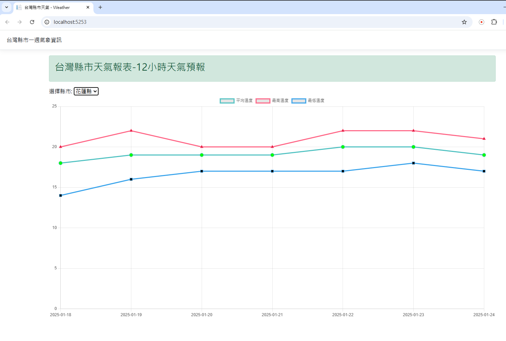

# Weather

此專案使用 Chart.js 提供氣象資料的視覺化呈現,需與專案 [WeatherApi](https://github.com/qwertasdx/WeatherApi) 一同使用。

兩個專案結合使用可以提供完整的天氣預報服務,包括:

1. **取得天氣預報資料**
   - 透過 WeatherApi 取得台灣各縣市的天氣預報資料

2. **視覺化呈現**
   - 在 Weather 專案中使用 Chart.js 將從 WeatherApi 取得的資料視覺化呈現

以下是呈現天氣預報資料的範例:

